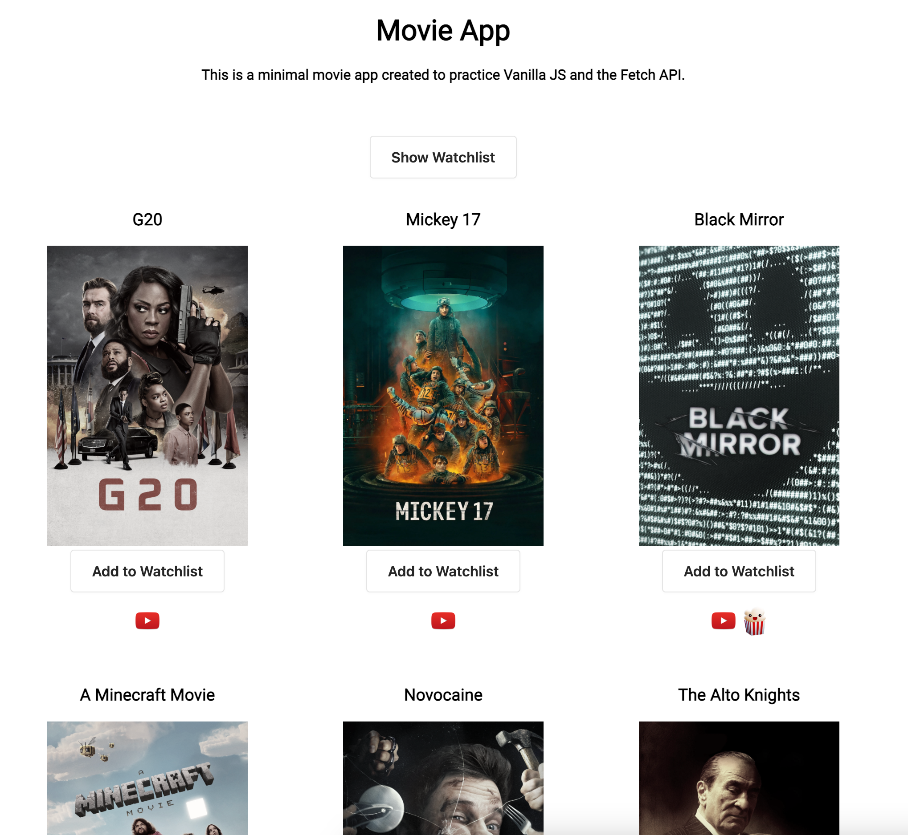

# Movie App

This project was used to learn Vanilla JS and how to create Docker Files

## What the app does
- Lists trending movies and tv shows
- Watch Trailers
- Create a personal non persistent Watchlist
- Popcorn Icon indicates whether the media is watch-worthy.

## How to install the movie app
1. Get your tmdb Api key [here](https://developer.themoviedb.org/docs/getting-started)

2. Create a env.js file with the api key
```js
export const env = {
    "apiKey":"<your Api Key here>"
};
```

3. Create Docker Container
```
docker build -t movieapp:latest
```

4. Run Docker Container
```shell
docker run -d --name=movieapp -p 80:80 movieapp
```